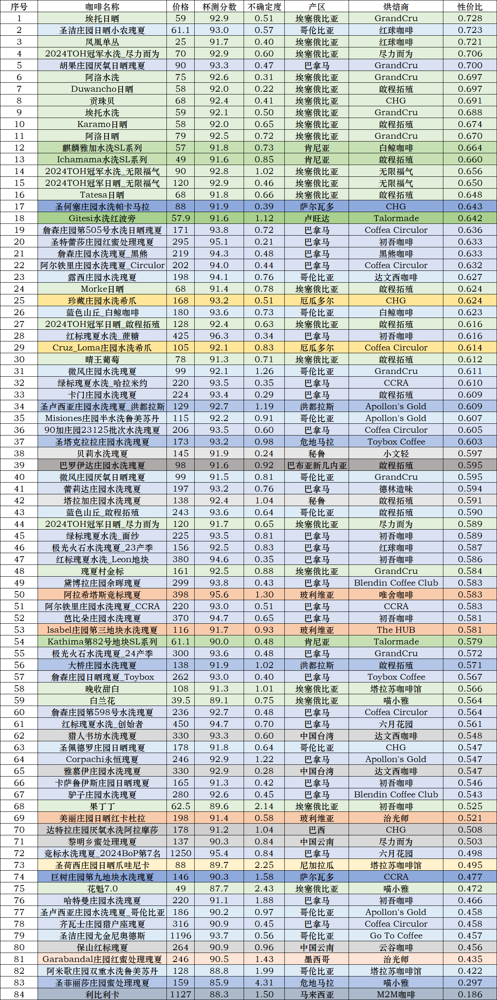
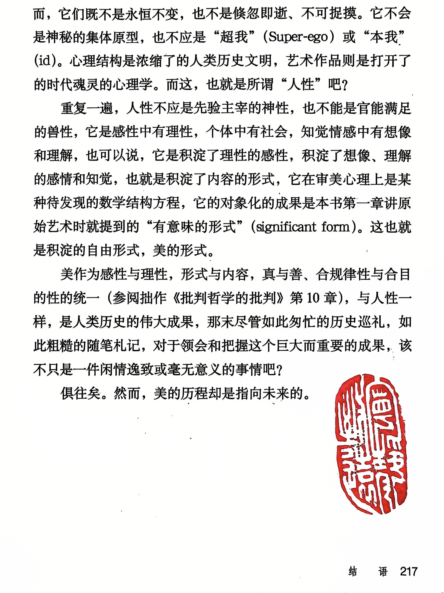

**咖啡评鉴（第三期）总结**

2023年3月至2024年1月的第二季咖啡评鉴进一步提高了笔者们对精品咖啡的系统认识。然而也遗留下来“如何更客观、准确地识别风味表现突出且具备高性价比的咖啡豆”的科学问题。为了进一步解决该问题，笔者们开启了第三季咖啡评鉴，该季评鉴从2024年1月17日起，自2025年1月6日结束，共涉及17个国家的84支精品咖啡豆。笔者不仅对这些咖啡豆进行了系统的杯测与评分，还结合统计学分析与性价比建模，从风味表现与性价比两个核心维度，对不同产区的整体风味趋势进行了细致梳理。同时，基于数据构建了一套更具参考价值的烘焙商评价体系，为精品咖啡的筛选与购买提供了更科学的决策依据。本次评鉴的成果能够加深爱好者对精品咖啡市场的理解，也可为未来选豆提供更为精准的指导。

[TOC]

## 1. 引言

在[第二季咖啡评鉴](https://mp.weixin.qq.com/s/ej2m-RAlZb1vAFUCZJ4V8A)结束的次日（2024年1月17日），第三季咖啡评鉴即正式启动。

如在[第二季的总结](https://mp.weixin.qq.com/s/ej2m-RAlZb1vAFUCZJ4V8A)中所述，本季咖啡评鉴的主要待解决科学问题是“如何更客观、准确地识别风味表现突出且具备高性价比的咖啡豆”。为了解决该问题，本季评鉴伊始，笔者们便确立了一个全新的探索体系，正如《咖啡品鉴（三期）：1. 新的聚焦角度》一文中所述——**“从线上到线下、从国内到国际的全时空精品咖啡探索体系”**。同时，在“咖啡外交”模式的推动下，笔者们通接触到了一批国内活跃在咖啡行业一线的杰出咖啡师。这些咖啡师不仅在日常咖啡事业中表现卓越，还频繁活跃于国内外的咖啡烘焙和冲煮比赛。在咖啡师们的帮助下，笔者们所品鉴到的同等价位咖啡，其口感和品质相较于第二季有了相当显著的提高——这也在一定程度上造成了**杯测分数的整体“通货膨胀”**现象，从而使得此前的性价比计算方法（如“对数标准化价格/绩点”公式）已不再适用（详见下文）。

2024年8月30日，笔者们连续第二年参加了中国（北京）国际咖啡展览会（图1.1），并在活动中评选出了我们所认为的最佳精品咖啡烘焙商——达文西咖啡（台湾）、初吾咖啡（天津）、GrandCru（深圳）和CCRA（北京）。随后，笔者们在这些烘焙商处广泛购置豆子进行深入评鉴，由此开拓了第二个评价维度——**从单纯按产区评价，扩展到按烘焙商评价**，逐步完善了评鉴体系。

（图1.1. 2024年8月30日，中国（北京）国际咖啡展览会现场。）

笔者们也比以往更加关注竞标豆（如巴拿马翡翠庄园、索菲亚庄园、阿尔铁里庄园、艾力达庄园、女巫庄园等，以及其他各国的竞标豆等）。尤其是通过我们的老朋友——六月花园咖啡馆，笔者们得以以最快的速度，评鉴到一系列新产季的巴拿马BoP竞标和庄园独立竞标咖啡豆。在六月花园，笔者们还参加了数次竞赛批次咖啡样品的杯测活动，如2024年2月3日的玻利维亚专场、‎2024‎年‎3‎月‎24‎日的印度尼西亚专场、2024年4月21日的咖啡马拉松、2024年8月3日的巴拿马翡翠庄园独立竞拍专场等（图1.2）。

（图1.2. 六月花园咖啡馆2024年的两场杯测活动掠影。（a）2024年2月3日的玻利维亚专场；（b）‎2024‎年‎3‎月‎24‎日的印度尼西亚专场。）

与此同时，通过ktt等线上平台，笔者们能在国内即可便捷地购买到由国际知名烘焙商烘焙的高品质咖啡豆，这些烘焙商包括挪威的Coffea Circulor和Talormade、澳大利亚的Toybox Coffee、日本的Apollon's Gold、美国的Blendin Coffee Club和马来西亚的The HUB等。2024年7-8月，笔者们还首次品鉴到了来自中国台湾知名烘焙商——黑熊咖啡和达文西咖啡所出品的咖啡豆，这进一步扩大了本季评鉴的咖啡品类与视野（图1.3）。借助这些电商，笔者们还首次尝试了**利比利卡**、**尤金尼奥德斯**和**阿拉摩沙**等非阿拉比卡大类的精品咖啡豆。这些咖啡品种在风味特征上独具一格，为评鉴增添了新的层次感。

（图1.3. 笔者们所购买的部分豆子。）

在本季中，为了进一步统一评鉴标准、获得更佳风味，笔者们对冲煮工具与方法继续进行了优化。例如，笔者们本季统一采用**农夫山泉泡茶水**和**司令官C40磨豆机**，以最大程度降低冲煮过程对风味的干扰。此外，**2024年9月25日**，老汪购入了一套虹吸壶，开启了**虹吸与手冲并行的评鉴时代**。虹吸壶冲煮出的咖啡在香气、甜感与醇厚度上表现更加突出，同时保持了与手冲相当的干净度。老汪因此对日晒豆的喜爱超越了水洗豆；而偏好干净口感与明亮酸感的老王，也将日晒豆提升至与水洗豆同等的喜爱程度。

（图1.4. 2024年9月25日，老汪正在操作虹吸壶。）

经过持续的评鉴以及相关资源和经验的积累，笔者们认为，第三季咖啡评鉴已经成功解决了第二季遗留下的关键科学问题，并在多维度上实现了全新的突破。因此，第三季咖啡评鉴于**2025年1月6日正式结束**。本文将首先通过对本季评鉴咖啡的**产区、类型和风味**进行全面总结，并结合统计学分析，得出咖啡风味排行榜、每个产区的特色豆，并评选出高质量咖啡烘焙商。随后，本季笔者们改良了算法，通过结合**多属性决策方法**、价格与品质的对数标准化，以及**网格搜索优化权重**，建立了更加科学和客观的咖啡性价比评估体系。最终，我们基于改良后的性价比评估，分别按**产区**和**烘焙商**维度，列出了精品咖啡豆的选购建议。

## 2. 第三季概述

### 2.1. 咖啡风味认识

在本产季的评鉴过程中，笔者们对精品咖啡风味的定义有了更深入的认识，尤其是在酸感的表达和烘焙技术对风味的影响上。归纳而言，影响咖啡风味的两大关键因素是**咖啡豆本身的质量**和**烘焙技术的精准掌控**。

一支真正优秀的咖啡，其风味首先取决于豆子本身的品种、产区风土、处理法等天然因素。笔者认为，衡量一支豆子本身质量的最佳指标是其**酸感的表达**——因为酸感是精品咖啡风味的脊梁骨，一支好的豆子必须要有足够令人愉悦的优质酸感。这里笔者沿用的是世界咖啡杯侧大赛中对“好的酸”的定义——**新鲜、有着甜感及活力、明亮**。C³offee 咖啡誌第39-40卷《烘焙与风味》一文进一步指出，在讨论酸质的表现中，第一个要点是像**“新鲜水果”**，不是果干也不是其他再制品，代表着酸的生动感。第二个要点是**“有活力的”**，当两种或三种以上酸同时存在时，更容易让我们感受到酸的活泼和变化感，使咖啡变得更多姿多彩，从而赋予咖啡更多的立体度和鲜活感。第三个要点是**“甜感”**，即咖啡中的酸更像是一颗成熟水果多汁且带着圆润的酸甜，而非生涩的不成熟水果带来的侵略性和刺激感。第四个要点是**“明亮”**，这是最为重要且最基本的切入点，这要求即使在酸的强度较弱的状态下，咖啡也仍然能够呈现上扬而清新的感受，同时不过度强烈。可见，酸感其实是很多其他感官风味——如香气、甜感和干净度等的基础，一杯具有足够“好的酸感”的咖啡，往往能派生出许多优质的咖啡风味。

（图2.1. 热带水果、苹果和柚子等水果的风味是精品咖啡的主要风味之一，再搭配上如酸奶般明亮而有甘醇的酸感，就形成了如水果捞或者酸奶果汁一样的精品咖啡风味。好的精品咖啡就像水果捞或酸奶果汁的“写意”形式。（图片由L君(小格)提供））

除了咖啡豆本身的品质，**烘焙水平**也是决定咖啡最终风味的关键要素。咖啡的烘焙不仅仅是一个加热过程，更是对风味的调校。不同的烘焙曲线会影响咖啡的酸甜平衡、层次丰富度以及干净度，甚至同一批咖啡，由不同烘焙师出品，也可能产生截然不同的风味表达。例如，在本文第2.3节读者们将看到，同样的高端咖啡豆，由不同的烘焙商处理，最终的杯测分数可能存在显著差异。这反映出烘焙不仅仅是“烧制”咖啡豆，而更像是**雕刻一件精美艺术品**——恰当的烘焙可以将咖啡豆的天然风味发挥到极致，而不当的烘焙则可能掩盖甚至破坏其原有的优质风味。正如北京“我与地坛”咖啡店的主理人所说：“**咖啡口感的质量，三分靠豆子，七分靠烘焙**。” 在世界顶级精品咖啡领域，烘焙师的技术水平决定了咖啡最终能否展现其真正的潜力——就像千里马需要伯乐的调教一样。

在下文中，我们将看到埃塞俄比亚、巴拿马、哥伦比亚等精品咖啡产区的豆子，凭借本评测季中表现出的惊艳风味与极高的可塑性，并在高超烘焙技术的加持下，如何备受像笔者这样的精品咖啡爱好者所青睐的。

### 2.2. 咖啡数量与豆种

本季评鉴的咖啡豆种数量大增，**有多于两次杯测记录的达到84支，较第二季（50支）增加68%**。但涉及豆种数比第二季有所减少——本季包括**14类豆种，较第二季19类（注：合并了74158和74112）减少26%**。豆种中，瑰夏占据了大半壁江山，有49支；其次是埃塞俄比亚的74系列，有16支；再次是埃塞俄比亚原生种，有4支。随后还有肯尼亚的SL系列（3支）、鲁美苏丹（2支）、希爪（2支）、阿拉摩沙（1支）、瑰夏1931（1支）、波旁（1支）、卡杜拉（1支）、利比利卡（1支）、帕卡马拉（1支）、爪哇尼卡（1支）和尤金尼奥德斯（1支）。其遗传关系如图所示。

（图2.2. 迄今为止笔者们所评鉴的咖啡豆的遗传系谱图。）

与上季相比，本季包括了6支新品种咖啡豆的评鉴，简要介绍如下：

**爪哇尼卡（Java Nica）**是一种非常独特的咖啡品种，其起源可追溯至20世纪初。1928年，荷兰植物学家P.J.S. Cramer从埃塞俄比亚引进了一系列阿拉比卡品种，种植于印度尼西亚的爪哇岛，形成了当地的“Java”品种。 随后，这些品种被引入尼加拉瓜，逐渐适应当地环境，成为尼加拉瓜的特色咖啡品种，被称为“爪哇尼卡”。爪哇尼卡的育种目的是为了结合 Typica 的高品质风味特性和抗病性更强的特性，同时改善其适应能力。爪哇尼卡咖啡风味带有明显的花香、柑橘和巧克力风味，酸感类似于柑橘，明亮且均衡，口感如奶油般顺滑。

**帕卡马拉（Pacamara）**是1958年由萨尔瓦多咖啡研究所（ISIC）培育出的杂交品种，结合了帕卡斯（Pacas）和象豆（Maragogipe）的特性。 帕卡斯是波旁（Bourbon）的自然变种，具有较矮的植株和紧凑的树叶，适应性强，抗病能力高，产量稳定。象豆是铁皮卡（Typica）的自然变种，以豆体巨大和独特风味著称。帕卡马拉结合了两者的优点，豆体较大，风味复杂多样，常表现出浓郁的香气、饱满的口感，以及柑橘、红莓、核果等水果风味。

**阿拉摩沙（Aramosa）**是阿拉比卡（Coffea arabica）与拉塞摩萨（Coffea racemosa）杂交而成的品种。拉塞摩萨是一种原产于南非北部和莫桑比克沿海森林的咖啡品种，具有天然低咖啡因含量的特性。因此，阿拉摩沙咖啡豆的咖啡因含量比大多数咖啡豆低约50%，并且通常具有浓郁的花香。 

**尤金尼奥德斯（Eugenioides）**是咖啡界的重要品种，被视为现代阿拉比卡咖啡的母种之一。它原产于东非高山地区，包括卢旺达、乌干达、坦桑尼亚、肯尼亚和刚果等国。尤金尼奥德斯的咖啡因含量约为阿拉比卡的一半，风味独特，甜感高，几乎没有柠檬酸。品尝时，常能感受到类似甜茶、百香果的风味，口感顺滑，被称为“不像咖啡的咖啡”。然而，尤金尼奥德斯的种植难度较大。其植株较小，果实和树叶都比一般咖啡豆小，每棵树的年产量仅约150克，远低于阿拉比卡的1000克。此外，它对病虫害的抵抗力较弱，特别容易受到咖啡叶锈病和害虫的侵袭。因此，全球仅有少数庄园种植该品种。然而近年来，尤金尼奥德斯在国际咖啡赛事中表现突出——2021年世界咖啡师大赛（WBC）和世界冲煮大赛（WBrC）的冠军选手均使用了尤金尼奥德斯咖啡豆，提升了其在咖啡界的知名度。

**利比里卡（Liberica）**起源于西非的利比里亚地区，因此得名。19世纪被人们发现并开始人工种植。由于其树木高大（可达6-20米）且果实较大，利比里卡也被称为“大果种”。目前，利比里卡咖啡主要种植于东南亚的菲律宾、印度尼西亚和马来西亚等地。 在菲律宾，利比里卡咖啡占所有种植咖啡的70%。利比里卡咖啡的风味以浓郁的木质香气和烟熏味著称，口感浓烈且独特。 然而，由于其风味独特且产量较低，利比里卡咖啡在全球咖啡市场中所占比例较小。

**鲁美苏丹（Rume Sudan）**是一个古老而稀有的咖啡品种，原产于南苏丹东南部靠近埃塞俄比亚边境的博马高原（Boma Plateau）鲁美山谷（Rume Valley）。 该品种以其优雅的花香、甜美的果汁风味和柠檬草香气而闻名。鲁美苏丹咖啡树高大，分枝间距适中，具有较强的抗病性，尤其对咖啡浆果病有较强的抵抗力。由于产量较低，鲁美苏丹很少被大规模商业种植，通常用于咖啡品种的研发，以提升咖啡的风味和抗病能力。2015年，澳大利亚选手Sasa Sestic在世界咖啡师大赛（WBC）中使用鲁美苏丹咖啡豆，凭借其独特的风味夺得冠军，使这一品种受到广泛关注。

### 2.3. 咖啡杯测分数榜

下图展示了本季所评鉴的所有84支咖啡的杯测分数总榜（不同颜色代表不同产区，下同）：

（图2.3. 第三季咖啡杯测分数总榜。）

下面为总榜前40名咖啡的属性概述：

总榜前10名中，包括1支玻利维亚瑰夏、1支哥伦比亚瑰夏，其余8支均为巴拿马瑰夏。这8支巴拿马瑰夏中有4支出自翡翠庄园。10支咖啡豆分别由初吾咖啡（4支）、六月花园（2支）、唯舍咖啡（1支）、黑熊咖啡（1支）、达文西咖啡（1支）和Coffea Circulor（1支）出品。

总榜第11-第20名中，包括1支哥伦比亚尤金尼奥德斯、2支哥伦比亚瑰夏和7支巴拿马瑰夏。10支咖啡豆分别由Coffea Circulor（2支）、啟程拓殖（2支）、Blendi Coffee Club（1支）、Go To Coffee（1支）、白鲸咖啡（1支）、GrandCru（1支）、CCRA（1支）和初吾咖啡（1支）出品。

总榜第21-第30名中，包括1支中国台湾瑰夏、1支厄瓜多尔希爪、1支危地马拉瑰夏、1支哥伦比亚瑰夏、2支埃塞俄比亚咖啡和4支巴拿马瑰夏。10支咖啡豆分别由GrandCru（2支）、Toybox Coffee（2支）、达文西咖啡（1支）、CHG（1支）、德林造味（1支）、CCRA（1支）、红球咖啡（1支）和尽力而为咖啡（1支）出品。

总榜第31-第40名中，包括1支中国台湾瑰夏、1支洪都拉斯瑰夏、3支巴拿马瑰夏和5支埃塞俄比亚咖啡。10支咖啡豆分别由GrandCru（3支）、Apollon's Gold（2支）、无限福气咖啡（2支）、达文西咖啡（1支）、Coffea Circulor（1支）和Blendi Coffee Club（1支）出品。

王氏标准杯测分数榜如下：

（图2.4. 第三季咖啡杯测分数榜——王氏标准。）

汪氏标准杯测分数榜如下：

（图2.5. 第三季咖啡杯测分数榜——汪氏标准。）

### 2.4. 各产区特色咖啡介绍

本季共评鉴了来自17个国家产区的精品咖啡，包括埃塞俄比亚、肯尼亚、卢旺达、巴拿马、哥伦比亚、危地马拉、萨尔瓦多、洪都拉斯、尼加拉瓜、墨西哥、玻利维亚、厄瓜多尔、秘鲁、巴西、马来西亚、巴布亚新几内亚和中国。然而，大多数国家都没有收集到足够多（≥3）的测评来更客观地反映产区特色，因此在此不再重复介绍。下面仅介绍本产季总结较为全面且最具特色的5个国家产区——**埃塞俄比亚、巴拿马、哥伦比亚、玻利维亚和中国**。对于其余的国家，请读者参见之前发表的本季的10篇分产区推送。

#### 2.4.1. 埃塞俄比亚——超乎寻常的风味之美

2024年新产季的埃塞俄比亚精品咖啡再次巩固了其在全球精品咖啡市场的标杆地位。本季产出的咖啡在风味表现上超乎寻常，整体风味层次丰富、酸质明亮且均衡，花香和水果风味极为突出，甚至堪比巴拿马和哥伦比亚的一众精品豆。同时，这一季的精品咖啡在全球市场上的性价比极高，不论是中高端日晒批次还是传统水洗批次，在杯测表现和价格维度上都展现出了强劲的竞争力。最引人注目的是，本季埃塞俄比亚的日晒处理咖啡豆全面占据主导地位，在2024年埃塞俄比亚“卓越杯”（Cup of Excellence, CoE）竞赛中，所有上榜的27支咖啡均为日晒豆，彻底确立了日晒处理在埃塞俄比亚精品咖啡市场中的主导地位。

（图2.6. 2024年埃塞俄比亚CoE竞拍于8月27日结束，总成交金额达90余万美金，平均每磅生豆24.64美元。（图片源于mcultivo.com））

相比往年，本季所评鉴的埃塞俄比亚日晒批次风味更为集中和饱满，酸质表现尤为明亮，果香甜感尤为突出。无论是年初所评鉴的[TOH冠军豆](https://mp.weixin.qq.com/s/NxnG2YuxD_Giblm9O_6yYw)，还是下半年的[阿洛和埃托等精品日晒咖啡豆](https://mp.weixin.qq.com/s/QbhTsX8TXlKm8F9fs8eUhg)，都展现出令人惊艳的层次变化：

- **酸质表现**：以柑橘、柠檬、青梅、西梅等果酸风味为主，酸感活泼且富有层次感。
- **花果香气**：干香常带有浓郁的玫瑰、茉莉、紫罗兰、橙花等花香，湿香则展现热带水果（荔枝、芒果、百香果）和莓果（蓝莓、草莓、红醋栗）的复杂香气。
- **甜感与醇厚度**：整体甜感较高，日晒豆的糖分转化充分，带来蜂蜜、红糖、水果糖的甜感。醇厚感柔和顺滑，余韵悠长，带有奶油、可可、红茶、葡萄干等尾韵。

此外，本季的埃塞俄比亚精品咖啡不仅风味表现惊艳，而且整体价格仍然维持在较高的性价比水平。相比于巴拿马、哥斯达黎加等精品咖啡产区近年来价格的迅猛上涨，埃塞俄比亚精品咖啡在价格维度上极具优势（除了瑰夏村之外其他几乎所有的埃塞熟豆每百克价都不高于100元），堪称“性价比之王”。更难能可贵的是，不论水洗还是日晒，2024产季埃塞俄比亚精品咖啡的风味表现始终稳定，避免了个别产区存在的批次间品质波动问题，整体杯测分数大多集中在91-93分之间，虽不及巴拿马的“极致干净感”，但综合表现更加均衡。因此，本季所评鉴的埃塞俄比亚咖啡表现，实在是出乎预料的精彩！

#### 2.4.2. 巴拿马——全球高端精品咖啡的首选

2024年新产季的巴拿马精品咖啡继续巩固其作为全球顶级精品咖啡标杆的地位。本季，巴拿马不仅在处理法的创新与复杂性上再次突破，而且在价格上继续刷新纪录。在2024年“最佳巴拿马”（Best of Panama, BoP）赛事中，艾丽达庄园Vuelta地块的日晒瑰夏拍出了每公斤生豆10013美金的天价，继2023年的10005美元/公斤后再度创下历史新高，确立了其作为全球最昂贵精品咖啡的王者地位。同时，巴拿马精品咖啡在风味稳定性和一致性方面依然表现卓越，确保了其在全球高端市场的持续统治力。

（图2.7. 2024年BoP赛事咖啡样品。摄于2024年7月13日，六月花园咖啡馆。）

相比传统的水洗和日晒处理，巴拿马精品咖啡的处理法在本季更加多样化，并且不断向更复杂、更高端的方向发展。尤其在实验批次和特殊处理法等方面，各大顶级庄园纷纷推出更具特色的处理方式，以进一步增强咖啡的风味层次和表现力。以黛博拉庄园和90+瑰夏庄园为典例，黛博拉庄园近年来较新的实验批次包括Horizon（厌氧日晒）、Illumination（低温发酵水洗）、Symbiosis（酵母接种日晒）、Eclipse（冷萃发酵日晒）等，高分批次展现出类似兰姆酒、葡萄干、焦糖、太妃糖的醇厚甜感，并伴有明显的玫瑰、草莓、百香果香气，独具个性。90+瑰夏庄园的创新处理法如Solar Kiln（暗房慢干蜜处理）、Criolic（低温控氧冷发酵）和Thermolic（热发酵）等，使得咖啡多带有金银花、人参和矮牵牛等独特风味，同样令人印象深刻。本季所评鉴的黛博拉庄园余晖瑰夏和90+庄园23125批次水洗瑰夏均获得了不错的杯测分数。

此外，其他的一些近年来较新的庄园结合水洗、酵母发酵和厌氧处理，使得其出品的一些批次咖啡风味更加复杂立体，酸甜平衡感极佳，喝起来很像继承了水洗和日晒处理的结合体，相当均衡。例如出现在评测列表里的Corpachi永恒瑰夏和齐瓦士庄园猎户座瑰夏等。此外，2024年12月底笔者们还在六月花园咖啡馆品鉴过一支风味相当突出的混合处理瑰夏。这支瑰夏由一个2024年刚刚成立的庄园——“无限庄园”(Finca Hachi)出品，这个庄园是由哥伦比亚天堂庄园的庄园主Diego在巴拿马哈特曼庄园的地块上建立的，采用了全新的咖啡基因纯化技术和混合处理法，使得咖啡既具有水洗豆明亮而干净的酸感表达，又具有日晒豆极致的香气和甜感，非常完美！（请参见[六月花园咖啡馆的介绍推送](https://mp.weixin.qq.com/s/OpqgdIPWxk6ZTPrCO23I0A)）期待这个庄园未来在BoP赛事中的精彩表现。

#### 2.4.3. 哥伦比亚——稳中求进，向巴拿马看齐

2023/2024 产季，哥伦比亚精品咖啡的表现可谓“稳中求进”。在世界精品咖啡行业中，哥伦比亚一直是风味表达和市场稳定性的代表，尤其是在本季的表现中，很多高端咖啡庄园和合作社都展示出了纯粹、未经香精处理的“非科技豆”，保留了哥伦比亚独特的本土风味，令笔者们所青睐。

本产季，哥伦比亚精品咖啡的风味表达更加稳定且层次丰富，特别是在中高海拔地区（如瓦耶德尔考卡、托利马、韦拉等），其咖啡风味更加清晰，酸甜感均衡，整体甜感突出，表现出向巴拿马高端精品咖啡看齐的趋势。

- **酸感**：相比于巴拿马的“明亮且极致的酸质”，哥伦比亚的酸感表现为更温和、均衡的柑橘、热带水果或莓果酸感，层次感较强，但不会过于刺激。
- **花果风味**：本产季的咖啡展现出了明显的花香、柑橘、莓果以及部分热带水果风味，整体风格介于埃塞俄比亚与巴拿马之间，既有细腻的白花香气，也带有复杂果酸的层次。
- **甜感与醇厚感**：本季哥伦比亚精品豆的甜感尤为突出，尤其是水洗批次，在蜂蜜、焦糖、红糖的表现上极具稳定性；醇厚感则更加细腻丝滑，口感干净且层次分明。

在本季的咖啡评鉴中，哥伦比亚希望庄园所出品的蓝色山丘（Cerro Azul）批次混合水洗瑰夏凭借93.6分的杯测分数（笔者们评鉴了两支蓝色山丘，分别由[白鲸咖啡](https://mp.weixin.qq.com/s/M_ImD7sfhmvBg0l1nt80zQ)和[啟程拓殖](https://mp.weixin.qq.com/s/ROvNjErzfH8TAua--cuTgA)出品，总分均为93.6），最受笔者们青睐。该批次展现出了极为纯净、细腻的风味表现，在不依赖香精处理的情况下，通过精细的发酵管理，使得瑰夏本身的特性得到了最大化释放。具体表现为其酸感更加温和而颇具层次（柑橘、柠檬、青梅），甜感更加突出饱满（晴王葡萄、荔枝、蜜瓜、香橙等果甜及红糖回甘），香气非常突出且复杂（茉莉、玉兰、葡萄、黄瓜、青草、佛手柑等），品来实在令人心旷神怡！

#### 2.4.4. 玻利维亚——印象深刻的后起之秀

在 2023/2024 产季，玻利维亚精品咖啡首次进入笔者的视野。尽管本季评鉴的玻利维亚咖啡支数较少，但整体表现令人印象深刻。本产季，玻利维亚精品咖啡的表现整体偏向高甜感、清晰果酸、花香突出，并且在口感上较为精致且富有层次。本产季的玻利维亚豆还采用一些特殊的后制处理法——如日晒乳酸发酵（美丽庄园日晒红卡杜拉）和咖啡果汁发酵（阿拉希塔斯瑰夏），均令人有不错的评鉴体验。

（图2.8. 第二届玻利维亚罗德里格斯家族私藏竞标竞拍活动于2024年2月6日结束。本季所评鉴的水洗组第一名的最终竞拍价格为每磅72.15美金。（图片源于卓越咖啡联盟网站））

在本季的咖啡评鉴中，[玻利维亚阿拉希塔斯（Alasitas）庄园所出品的咖啡果汁发酵水洗瑰夏](https://mp.weixin.qq.com/s/NxnG2YuxD_Giblm9O_6yYw)凭借95.6分的杯测分数位列总排行榜第二名，其中王氏分数96.5±0.5分（位列王氏排行榜第二），汪氏分数94.0±0.5分（位列汪氏排行榜第八），无疑是本季最令人惊艳的咖啡之一。这支咖啡同样还是罗德里格斯家族私藏竞标水洗组第一名的竞标豆。其干香展现出浓郁的金银花与茉莉花香，并在湿香中进一步叠加奶油、小青桔和佛手柑的清新气息，层次丰富且极具辨识度。风味表现方面，前调呈现出柑橘、甜橙、蜜桃和茉莉的明亮风味，中后调茉莉的优雅香气进一步加强，而金银花的回归赋予整体风味更高的层次感。与此同时，柑橘、甜橙和蜜桃三者协同作用，赋予此支咖啡极佳的酸甜平衡，这种特质贯穿至悠长的余韵，体现为持续不断的茉莉、蜂蜜、金银花、香油的甜感，并伴随奶油般的微醇厚感，细腻而优雅。低温风味呈现出更明亮的柠檬式酸感，冲煮后期的残余液体稀释后，表现出红茶般的干净感，进一步凸显其超高的层次感与卓越的干净度。因此整体而言，阿拉希塔斯瑰夏凭借极致的花果风味、均衡的酸甜感和悠长细腻的余韵，在本产季玻利维亚精品咖啡中树立了极高的标杆，甚至具备媲美巴拿马顶级瑰夏的水准。

#### 2.4.5. 中国——云南仍待突破，台湾惊艳亮相

在2023/2024产季，中国精品咖啡继续受到关注，但笔者注意到云南和台湾两个主要产区展现出截然不同的发展趋势。

作为中国精品咖啡的主要产区，云南在过去几年里投入了大量资源试图提升品质，并试验了包括瑰夏、帕卡马拉和希爪在内的多个高端品种。然而，受限于风土条件，云南的高端咖啡仍未达到世界顶级水平。整体口感偏淡，层次感较低，即使是瑰夏种，在云南的风味表现也较为平淡，不及同品种在中美洲或非洲的表现。此外，云南精品咖啡的生产成本极高，无论是种植、采摘还是处理的投入，都远高于全球其他精品咖啡产区，使得其性价比难以匹敌。近年来市场上增味咖啡（科技豆）泛滥，也让云南精品咖啡的纯粹性受到一定挑战，部分云南产区甚至在追求创新的过程中忽略了咖啡本身的风味表达。

相比之下，台湾产区的表现令人耳目一新。今年是笔者首次尝试台湾精品咖啡，但其品质之高远超预期，部分咖啡的风味表现甚至可以媲美中南美洲的高端精品豆。台湾精品咖啡展现出极佳的层次感、明亮的果酸以及优雅的花香调性，尤其是在阿里山等高海拔地区种植的瑰夏，具备稳定的风味表现和优雅的余韵。此外，台湾产区的风味表达更加干净，口感醇厚且酸甜平衡，这使得其精品咖啡在亚洲市场乃至国际市场上都展现出极大的竞争力。本季评鉴中，[猎人书坊的水洗瑰夏](https://mp.weixin.qq.com/s/u6Bs3bQKivCwmV4zFY_BMw)以93.3分的杯测分数位列总排行榜第21名（前25%），其中王氏分数93.5±0.5分（位列王氏排行榜第23名），汪氏分数93.1±0.6分（位列汪氏排行榜第21名），是本产季笔者们所评鉴的最佳亚洲产区咖啡豆。

整体而言，中国精品咖啡的进步空间依然很大。云南产区仍需在提升风味浓度、优化处理工艺以及控制生产成本上进行更多尝试，同时避免过度依赖增味工艺，回归到风味本身。而台湾精品咖啡的品质已经足够优秀，未来如果能进一步扩展种植面积、提高产量并稳定供应、同时降低成本，将有潜力成为亚洲高端精品咖啡的代表之一。未来几年，中国精品咖啡若能进一步发展，相信能在国际市场上占据更加稳固的地位。

## 3. 咖啡杯测分数与性价比量化——方法

本部分所述之方法以及绘图工作，均使用MATLAB™ R2024b完成。这些代码目前已按照GNU General Public License v3.0协议在GitHub网站开源（详见文末的**数据与代码可用性声明**）。有关详细的使用说明，请参照本部分或网站内的README.md文档。

### 3.1. 咖啡杯测分数统计

本次杯测分数统计所采用的方法均基于每支咖啡的杯测分数均值和标准差——因为这两个统计量无需对数据分布情况的任何先验假定。单支咖啡的杯测分数均值和标准差（注：对应于excel里的STDEV.P函数）计算公式如下：
$$
{\overset{-}{x}_\text{sample}} = \frac{1}{n}{\sum\limits_{i = 1}^{n}x_i}
$$

$$
s_\text{sample} = \sqrt{\frac{\sum\limits_{i = 1}^{n}\left( x_{i} - {\overset{-}{x}})^{2} \right.}{n}}
$$

为了探讨产地对咖啡风味的影响，我们将本年度所参与评鉴的84支咖啡，按所属产区和风味特征分为埃塞俄比亚（Ethiopia）、巴拿马（Panama）、哥伦比亚（Columbia）、肯尼亚和卢旺达（Kenya & Rwanda）、中美洲（Central America，包括墨西哥）、南美洲（South America）和亚洲（Asia）这七大产区。

#### 3.1.1. 王氏和汪氏杯测分数的总体分布

首先，我们需要从一个宏观的角度对王氏和汪氏杯测分数的总体分布情况进行理解。为了实现这一点，我们引入两种参数分布——**高斯正态分布**（Gaussian Normal Distribution）和**t位置尺度分布**（t-location-scale distribution）。我们希望通过比较杯测分数与这两种参数分布的异同，来实现对杯测分数的客观认识，并进一步有利于后续的统计处理。

下面是对这两个分布的简要介绍：

（1）高斯正态分布，又称正态分布，是概率统计中最重要的分布之一，描述了许多自然现象的数据分布形式。其概率密度函数呈对称的钟形曲线，均值所在位置为分布的中心。其概率密度函数公式为：
$$
f(x; \mu, \sigma) = \frac{1}{\sqrt{2\pi} \sigma} e^{-\frac{(x - \mu)^2}{2\sigma^2}}
$$
其中x为随机变量，μ为均值，决定分布的中心位置；σ>0，表示标准差，决定分布的宽度（数据的离散程度）。

（2）t位置尺度分布（t-location-scale distribution）是对标准t分布的扩展。它通过引入位置参数和尺度参数，使t分布具有更大的灵活性，能够表示位置（均值）和尺度（扩散程度）的变化。其概率密度函数公式为：
$$
f(x; \mu, \sigma, \nu) = \frac{\Gamma\left(\frac{\nu + 1}{2}\right)}{\sqrt{\nu \pi} \, \sigma \, \Gamma\left(\frac{\nu}{2}\right)} \left[1 + \frac{1}{\nu} \left(\frac{x - \mu}{\sigma}\right)^2 \right]^{-\frac{\nu + 1}{2}}
$$
其中x表示随机变量；μ表示**位置参数**，表示分布的中心（类似于均值）；σ表示>0的**尺度参数**，表示分布的扩散程度（类似于标准差）；ν表示>0**自由度参数**，控制分布的尾部厚度；Γ(⋅)表示伽玛函数。

t位置尺度分布可以看作是正态分布的广义形式——当自由度 ν→∞ 时，t位置尺度分布逐渐趋近于正态分布；但t位置尺度分布的尾部比正态分布更厚（重尾分布），这意味着t位置尺度分布对异常值更具鲁棒性，适用于描述具有重尾特性的数据——这也是笔者选取该分布作为与高斯正态“互补”的参数分布的原因——能够处理那些形态接近于高斯正态、但存在明显偏态和重尾的数据。

#### 3.1.2. 王氏和汪氏标准的分数异同

其次，我们关注的是在现行评测标准下，王氏和汪氏两种方法对同产区咖啡的评测分数是否相同。首先通过**带误差线的散点投图**，将王氏和汪氏杯测分数与1:1线进行比较，从而实现总体评测分数的半定量比较。其次，我们根据上述七个产区分类，分别将王氏和汪氏的杯测分数进行按产区的**箱线图**绘制，以实现评测分数的按产区半定量比较。

杯测分数的定量比较主要采用**双样本t检验**和**Mann-Whitney U检验**的方式完成。其中，双样本t检验是在假设数据服从正态分布的前提下，用于比较两组数据的均值是否存在显著差异。Mann-Whitney U检验则属于非参数检验（无需数据分布的先验假设），用于比较两组数据的中位数是否有显著差异。

#### 3.1.3. 产区杯测分数总体比较

随后，根据各产区内部咖啡杯测分数的平均值和标准差，我们希望能够得到对该产区杯测分数和标准误差的定量估计，并与其他产区相互比较。注意：本部分中的术语“标准误差”(standard error)与计量指南联合委员会（JCGM）发布的《测量不确定度表示指南》（GUM）中的“平均值的实验标准偏差”(experimental standard deviation of the mean)具有相同的定义(https://www.bipm.org/utils/common/documents/jcgm/JCGM_100_2008_E.pdf)，并用作不确定性的度量。

为了实现这一点，假设某个产区内有n组咖啡杯测分数，每个杯测分数的平均值由x̄sample,i表示，那么该产区的合并加权平均值（x̄pooled）即可以代表该产区的总体杯测分数。**合并加权平均值**（Pooled weighted mean）将加权平均值计算为加权值的总和除以权重的总和：
$$
\overline{x}_{\text{pooled}} = \frac{\sum_{i=1}^n \left( \overline{x}_{\text{sample},i} \cdot w_i \right)}{\sum_{i=1}^n w_i}
$$
其中
$$
w_i = \frac{1}{s_{\text{sample},i}^2}
$$
代表每个咖啡杯测分数的权重（s2sample,i代表该产区n组咖啡中第i组咖啡的杯测分数方差）。

另一方面，还可以使用涉及权重的标准化因子进一步计算出**合并标准误差**（spooled, Pooled standard error）：
$$
s_{\text{pooled}} = \sqrt{\frac{1}{n} \cdot \frac{\sum_{i=1}^n w_i \cdot \sum_{i=1}^n \left[ \left( \overline{x}_{\text{sample},i} - \overline{x}_{\text{pooled}} \right)^2 \cdot w_i \right]}{\left(\sum_{i=1}^n w_i \right)^2 - \sum_{i=1}^n w_i^2}}.
$$
随后，为了评估观测数据（杯测分数）中的变异性与通过合并标准误差得出的变异性的一致性，在假设每次杯测结果彼此独立且服从正态分布的条件下，可以使用卡方分布定量评估其拟合概率。该概率由以下公式给出：
$$
P = 1 - F_{\chi^2}(\chi^2; f)
$$
其中F为自由度为𝑓的卡方分布的累积分布函数（CDF），自由度𝑓 = n - 1.

同时通过下式得到特定置信水平(1−α)下的**合并加权平均值的置信区间范围**(CI)：
$$
\text{CI} = t_{\alpha/2}(f) \cdot s_{\text{pooled}}
$$
其中tα/2(f)是特定置信水平(1−α)和自由度f下的t临界值。在本文中，我们考虑95%的置信区间。

最后，我们采用**均方加权偏差**（Mean Squared Weighted Deviation, MSWD），来评估（1）产区内部单个杯测结果的不确定性的可靠性（内部精度）；（2）产区内部不同杯测结果之间的一致性（外部精度）。其计算公式如下：
$$
\text{MSWD} = \frac{\sum_{i=1}^n w_i \cdot \sum_{i=1}^n \left[ \left( \overline{x}_{\text{sample},i} - \overline{x}_{\text{pooled}} \right)^2 \cdot w_i^2 \right]}{\left(\sum_{i=1}^n w_i\right)^2 - \sum_{i=1}^n w_i^2}
$$
如果合并加权平均值的不确定度与杯测结果的离散程度一致，则MSWD将接近于1。如果MSWD明显大于1，则表明可能存在离群值、低估了不确定度或存在未建模的数据分布情况。相反，低于1的MSWD表明不确定度可能被高估、数据间高度一致或数据量不足。

### 3.2. 咖啡性价比评价算法

#### 3.2.1. 算法背景

性价比作为衡量商品价格与性能优劣的重要指标，能够为决策者提供选择依据。然而，在传统性价比计算方法（如对数标准化后的价格/绩点，请参见《咖啡评鉴（二期）总结》）中，单一维度的考量往往难以全面反映产品的真实价值，尤其是在涉及复杂变量时显得不够客观和精确。因此，**我们提出了一种全新的性价比算法**，通过引入先进的TOPSIS（接近理想解排序法）方法，结合对数标准化和网格搜索技术，从多维度综合评价备选方案。这一算法的核心在于平衡价格、品质和品质不确定度三方面的影响，以下是具体分析：

第一，咖啡性价比并不只取决于价格，还要同时平衡咖啡的品质和品质不确定度。若只考虑价格，可能忽略了品质的重要性；若只考虑品质，则会忽略成本对消费者决策的影响；若不考虑品质的不确定度，则难以反映实际口感的波动。为此，我们设立价格（越低越好）、杯测分数（越高越好）和杯测分数不确定度（越小越好）**三个指标**，以避免因片面追求低价或高分而忽略其他关键因素的不足，因此能够更全面地反映咖啡的整体价值。

第二，三个指标的数值范围与分布可能差异较大，且指标中的极值对于结果的影响较突出。为了减少这种影响，并让不同量纲的数值具有可比性，我们在计算中采用**对数归一化**的方式进行缩放。对于价格和不确定度这类成本型指标，处理后再取反；对于杯测分数这类效益型指标，则直接使用归一化后的数值。通过这一过程，可以减小极端数据带来的偏差，并保证不同维度数据之间具备更合理的比较基础。

第三，在多指标评价中，权重的选择直接影响结果的公正性。为了避免主观赋权的偏差，我们采用**网格搜索**方法，系统遍历所有满足权重和为1的组合（步长=0.01），并评估每组权重对最终综合评价结果的影响。通过计算不同权重组合下各指标与整体结果的相关性，选取最能平衡各因素的权重分配方式，从而提高结果的客观性与公正性。

最后，在完成数据归一化与权重分配后，我们借助TOPSIS方法，分别计算各备选方案到“理想解”（各指标最优值）和“负理想解”（各指标最差值）的距离。通过比较每个方案的**贴近度**（即更靠近理想解的程度），实现性价比的科学排序。TOPSIS的引入使得算法能够同时兼顾多个维度的最优解特性，为最终决策提供可靠依据。

#### 3.2.2. 算法原理

##### 3.2.2.1. 多属性决策的核心思想

多属性决策问题通常通过以下步骤解决：

1. **标准化**：消除不同属性量纲和数值范围的影响，使其具有可比性。
2. **加权计算**：为不同属性分配权重，根据属性的重要性调整其对决策的影响。
3. **评价模型**：使用特定算法（如 TOPSIS）计算每个方案的得分并排序。

##### 3.2.2.2. TOPSIS方法在咖啡性价比的应用

TOPSIS（Technique for Order Preference by Similarity to Ideal Solution）是一种多属性决策方法，广泛用于综合评价和排序问题。其核心思想是：**最优方案应距离理想解最近，同时距离负理想解最远**。

假设有 m 个评价对象（方案），每个对象有 n 个指标（属性）。构建一个 m×n 的决策矩阵：
$$
X = \begin{bmatrix} x_{11} & x_{12} & \cdots & x_{1n} \\ x_{21} & x_{22} & \cdots & x_{2n} \\ \vdots & \vdots & \ddots & \vdots \\ x_{m1} & x_{m2} & \cdots & x_{mn} \end{bmatrix}
$$
其中 *xij* 表示第 i 个方案在第 j 个指标下的值。

##### 3.2.2.3. 数据导入与指标归一化

为了得到咖啡的性价比，这里我们考虑三个指标——（1）**价格**：咖啡的每百克价格（人民币），是成本型指标，值越小越好；（2）**品质**：杯测分数，是效益型指标，值越大越好；以及（3）**品质不确定度**：杯测分数的90%单侧置信区间值（假设对同一咖啡的不同打分结果之间遵循t分布），是成本型指标，值越小越好。

为了消除指标量纲差异，采用对数归一化，即首先对所有指标取对数以避免偏态影响，并减小极值对结果的影响，使得价格、品质和品质不确定度的范围更加一致。随后，对于成本型指标（价格和品质不确定度），归一化后取反，使得值越小越好；对于效益型指标（品质），则归一化后不进行取反，使得值越大越好。公式如下：

- **成本型指标**（价格、不确定度）：
  $$
  r_{ij} = \frac{\max(\log(x_j + c)) - \log(x_{ij} + c)}{\max(\log(x_j + c)) - \min(\log(x_j + c))}
  $$

- **效益型指标**（性能）： 
  $$
  r_{ij} = \frac{\log(x_{ij} + c) - \min(\log(x_j + c))}{\max(\log(x_j + c)) - \min(\log(x_j + c))}
  $$

其中c为一个保证对数运算内部值不为0的小正数（为不影响数据整体分布，本例中取0.01）。标准化后，得到矩阵 R：
$$
R = \begin{bmatrix} r_{11} & r_{12} & \cdots & r_{1n} \\ r_{21} & r_{22} & \cdots & r_{2n} \\ \vdots & \vdots & \ddots & \vdots \\ r_{m1} & r_{m2} & \cdots & r_{mn} \end{bmatrix}
$$

##### 3.2.2.4. 权重分配

随后，需要考虑上述三个指标对性价比结果的影响的轻重程度，即权重。我们希望调整价格、品质和品质不确定度的权重，使性价比与各指标的相关性差异最小，从而尽可能减少主观性。为此，我们通过**网格搜索**（grid search）来确定最佳的权重比。考虑权重约束条件：
$$
w_1 + w_2 + w_3 = 1
$$
其中w1、w2和w3分别表示价格、性能和性能不确定度的权重。

##### 3.2.2.5. 计算性价比

1. 在得到权重最优解后，计算加权标准化矩阵： 
   $$
   r'_{ij} = w_j \cdot r_{ij}
   $$

2. 确定理想解和负理想解，其中**理想解（*A+*）**是每个指标的最优值（效益性指标的最大值，成本型指标的最小值）：

$$
A^+ = \left( \max(r_{ij}) \text{ 或 } \min(r_{ij}) \right), \, j = 1, 2, \dots, n
$$

​	**负理想解（*A-*）**是每个指标的最差值（效益性指标的最小值，成本型指标的最大值）：
$$
A^- = \left( \min(r_{ij}) \text{ 或 } \max(r_{ij}) \right), \, j = 1, 2, \dots, n
$$

3. 随后，计算到理想解和负理想解的距离： 

$$
D_i^+ = \sqrt{\sum_j (r'_{ij} - r_j^+)^2}, \quad D_i^- = \sqrt{\sum_j (r'_{ij} - r_j^-)^2}
$$

4. 最后，定义并计算贴近度（Closeness Coefficient, *Ci*），作为方案优劣的衡量指标：

$$
C_i = \frac{D_i^-}{D_i^+ + D_i^-}
$$

​	由公式易知，Ci 越大，表示性价比越高。最终，按性价比得分 Ci 对所有方案降序排序，并输出最优权重及最终结果。

#### 3.2.3. 采用TOPSIS方法的优势

在本期咖啡杯测中，我们最终选取优化了的TOPSIS方法进行性价比计算，主要是根据第3.1.1节所描述的数据特性而决定的。该方法存在以下显著优势：

1. **对极值鲁棒**：对数归一化减小了极值对结果的影响，使得价格、品质和品质不确定度的范围更加一致。
2. **多维度综合考虑**：同时考虑价格低、品质高和品质不确定度小的影响，综合性强。
3. **权重优化**：通过网格搜索自动调整权重，确保性价比与各指标的相关性均衡。
4. **通用性强**：适用于多指标、多维度决策问题，且可扩展到更多指标。

## 4. 咖啡杯测分数与性价比量化——结果

### 4.1. 评测分数分布与一致性检验

经过统计分析，汪氏杯测分数的平均分为92.3，1σ标准差1.3，中位数92.4，最高分96.1，最低分88.9；王氏杯测分数的平均分为92.2，1σ标准差2.2，中位数92.3，最高分96.5，最低分82.8。在具体评测中，最高分对应的咖啡均为巴拿马翡翠庄园蔗糖地块水洗红标瑰夏（由初吾咖啡出品），而最低分的咖啡均为危地马拉圣菲里丽莎庄园蜜处理瑰夏（由喵小雅咖啡出品）。从数据来看，两套评分体系的平均分均落在彼此1σ标准差范围内，即两者在整体评分上具有较高一致性。然而，王氏评分体系的最高分更高、最低分更低，表现出更大的分数离散性。

正态性检验方面，经单样本柯尔莫可洛夫-斯米洛夫（Kolmogorov-Smirnov, K-S）检验，汪氏杯测分数符合高斯正态分布，并可通过下列正态分布函数进行最佳拟合：
$$
f(x) = \frac{1}{\sqrt{2\pi} \cdot 1.35} e^{-\frac{(x - 92.30)^2}{2 \cdot 1.35^2}}
$$
而王氏杯测分数则未通过正态性检验，但经单样本Anderson–Darling检验，其符合t位置尺度分布，并可通过下列分布函数进行最佳拟合：
$$
f(x) = \frac{\Gamma\left(\frac{\nu + 1}{2}\right)}{\sqrt{\nu \pi} \cdot 1.41 \cdot \Gamma\left(\frac{\nu}{2}\right)} [1 + \frac{1}{\nu} \left(\frac{x - 92.37}{1.41}\right)^2]^{-\frac{\nu + 1}{2}}
$$

在分位图（Quantile-Quantile plot, QQ图）的可视化分析中（如图4.1a和b所示），可以清晰地看出王氏评分体系在低分段比标准正态分布更低，而在高分段则比标准正态分布更高。此外，由于杯测分数的理论最大值为100，导致王氏评分在低分段的分布范围远大于高分段。这一特性使得王氏评分体系整体上明显偏离正态分布。

（图4.1. 汪氏和王氏评分体系的杯测分数分布检验。（a）汪氏杯测分数的分位图；（b）王氏杯测标准的分位图；（c）汪氏杯测分数的频率分布图与正态分布拟合函数；（d）王氏杯测分数的频率分布图与t位置尺度分布拟合函数。）

事实上，这种偏差并非偶然，而是笔者刻意为之。在第三季评鉴之初，老王与老汪就达成共识：（1）汪氏评分体系尽可能客观无偏地衡量咖啡风味；（2）王氏评分体系则刻意拉大区分度，对低分咖啡打得更低，对高分咖啡打得更高，以减少由于样本数波动带来的随机效应。因此，从最终的数据分布来看，这一策略得到了良好的实现。

如果将王氏评分 vs. 汪氏评分绘制为带误差线（1σ）的散点图，同时在横坐标轴上侧和纵坐标轴右侧分别展示两者的频率分布图，则可以更直观地展现两者的评分分布特性（图4.2）：（1）在低分段（<91分），王氏评分明显比汪氏评分更低；（2）在高分段（>94分），王氏评分又明显高于汪氏评分；（3）在91-94分的中间分段，两者的评分基本一致，几乎可以通过1:1线进行拟合。

（图4.2. 汪氏和王氏评分体系的一致性检验，结果由带误差线的散点图叠加频率分布图展现。）

为了进一步验证两套评分体系的总体一致性，我们进行了双样本Mann-Whitney U检验和t检验。结果显示Mann-Whitney U检验的p值为0.646（>0.05），无显著差异；t检验的p值为0.938（>0.05），同样无显著差异。因此，虽然王氏评分体系的分布特性与汪氏有所不同，但从统计学角度来看，两者在总体评分上的差异并不显著，证明了两套评分体系的可比性与互补性。

### 4.2. 七大产区之杯测分数

图4.2中展示了汪氏和王氏评分体系下七大产区（埃塞俄比亚、巴拿马、哥伦比亚、肯尼亚和卢旺达、中美洲（包括墨西哥）、南美洲和亚洲）杯测分数的差异。为更直观地呈现这一对比，图4.3 采用箱线图（boxplot），以不同颜色区分王氏（红色）和汪氏（蓝色）评分体系，详细展示了不同产区间及评分体系间的评分分布情况。

（图4.3. 咖啡杯测分数箱线图。横坐标为七大产区，纵坐标为评分。箱体三条横线分别表示75%分位数、中位数和25%分位数，上下横线表示最大值和去除离群值后的最小值，“×”表示离群值，箱体缺口表示中位数的95%置信区间。）

由图4.3可直观得出以下结论：首先，巴拿马、哥伦比亚和埃塞俄比亚无疑是老王和老汪最为喜爱的三大精品咖啡产区，这三个产区的杯测分数在整体体系中保持领先地位。其次，哥伦比亚、中美洲和亚洲的评分浮动较大，表明这些产区的咖啡品质或烘焙水平存在一定程度的不均衡，可能受到产区内部豆种差异或烘焙风格的影响。此外，为了进一步验证评分体系的内部一致性，我们针对不同产区的数据进行了Mann-Whitney U检验和t检验，结果显示：**在95%置信水平下，两种评分体系在各产区内均无显著性差异**，这一结果再次证明了王氏和汪氏评分体系在各自评测标准下保持了较高的自洽性。

为了尽可能减少评分体系主观性的影响，将王氏和汪氏评分体系汇总得到的总杯测分数表（图2.3）将更有指示意义。我们对总杯测分数进行按产区的合并加权平均，结果如表1的第2-4列所示。由表中结果可见，本季风味表现最佳的产区（综合考虑加权平均分和95%置信区间）依次为巴拿马、哥伦比亚、埃塞俄比亚、南美洲、亚洲、中美洲、肯尼亚/卢旺达，其中巴拿马咖啡整体评分最高，而亚洲和肯尼亚/卢旺达的评分分布则相对较为分散。

<b>表1. 按七大产区的杯测分数和性价比总结</b>
 

|   咖啡产区    | 杯测分数合并加权平均 | 95%置信区间 | MSWD |  性价比  | 1sd  |
| :-----------: | :------------------: | :---------: | :--: | :------: | :--: |
|  埃塞俄比亚   |         92.1         |    0.33     | 1.49 | **0.64** | 0.07 |
|    巴拿马     |       **93.8**       |    0.53     | 15.9 |   0.58   | 0.05 |
|   哥伦比亚    |         92.8         |    0.82     | 2.32 |   0.57   | 0.09 |
| 肯尼亚/卢旺达 |         90.8         |    1.67     | 3.21 |   0.64   | 0.04 |
|    中美洲     |         91.9         |    0.90     | 0.55 |   0.52   | 0.11 |
|    南美洲     |         92.1         |    0.78     | 2.32 |   0.58   | 0.04 |
|     亚洲      |         92.5         |    1.50     | 4.60 |   0.47   | 0.15 |

此外，我们进一步筛选出本季评鉴中单个烘焙商出品的咖啡支数≥3支的烘焙商，共计12家，包括Apollon's Gold、CCRA、CHG、Coffea Circulor、GrandCru、初吾咖啡、啟程拓殖、喵小雅、塔拉苏咖啡馆、尽力而为、红球咖啡和达文西咖啡，并对其综合杯测分数进行分析（见表2，第3-5列）。结果表明，在综合评分方面，**初吾咖啡（天津）的杯测分数最高**，代表其咖啡的平均质量最佳，CCRA（北京）和达文西咖啡（台湾）紧随其后，而Coffea Circulor（挪威）与GrandCru（深圳）并列第三，表现同样出色。

<b>表2. 按烘焙商的杯测分数和性价比总结</b>
 

| 国家或地区      | 咖啡支数 | 杯测分数合并加权平均 | 95%置信区间 | MSWD | 性价比   | 1SD  |
| --------------- | -------- | -------------------- | ----------- | ---- | -------- | ---- |
| Apollon's Gold  | 4        | 91.84                | 2.01        | 1.52 | 0.56     | 0.1  |
| CCRA            | 3        | 93.23                | 2.13        | 1.21 | 0.56     | 0.1  |
| CHG             | 5        | 92.25                | 0.81        | 1.55 | 0.60     | 0.1  |
| Coffea Circulor | 6        | 92.75                | 1.37        | 7.91 | 0.58     | 0.1  |
| GrandCru        | 9        | 92.73                | 0.44        | 1.15 | 0.65     | 0.1  |
| 初吾咖啡        | 8        | **94.66**            | 1.42        | 18.7 | 0.57     | 0.1  |
| 啟程拓殖        | 12       | 92.35                | 0.53        | 6.26 | 0.62     | 0.0  |
| 喵小雅          | 3        | 88.92                | 3.54        | 0.5  | 0.44     | 0.1  |
| 塔拉苏咖啡馆    | 3        | 90.61                | 3.51        | 0.92 | 0.49     | 0.1  |
| 尽力而为        | 3        | 91.94                | 3.09        | 3.15 | 0.60     | 0.1  |
| 红球咖啡        | 3        | 92.16                | 1.91        | 2.52 | **0.68** | 0.1  |
| 达文西咖啡      | 3        | 93.07                | 1.44        | 1.32 | 0.57     | 0.1  |

### 4.3. 七大产区之性价比

如第3.2节所述，我们采用对数归一化方法来消除性价比各指标之间的量纲差异，并通过网格搜索寻找使性价比与各指标的相关性差异最小的权重组合，以降低主观因素对结果的影响。最终，我们确定了最优权重比为价格（Price）：杯测分数（Performance）：杯测分数不确定度（Uncertainty）= 0.40:0.43:0.17，并基于此权重比，运用TOPSIS方法计算了最终的性价比排名。

为了更直观地展现与性价比相关的三个关键指标的归一化后取值范围及其相互关系，图4.4绘制了这三者的相关性矩阵散点图，同时在对角线上放置了各指标的分布直方图。从图中可以看出，在归一化后，所有指标的取值均被压缩至0至1之间，且整体上近似服从正态分布，表明对数归一化方法成功发挥了作用。此外，从相关性矩阵可以观察到，杯测分数与价格呈正相关，杯测分数与不确定度呈负相关，而价格与杯测分数不确定度无明显相关性。换言之，**价格较高的咖啡往往在杯测分数上表现更佳，且评分稳定性也更高**，这一趋势与直觉经验相符，也进一步验证了数据分析的合理性。

（图4.4. 价格(Price)、杯测分数(Performance)和杯测分数不确定度(Uncertainty)的相关性矩阵散点图及其分布直方图。）

图4.5展示了完整的性价比从高到低排名榜单。由图4.5可见，榜单前10名中，包括1支巴拿马瑰夏、1支哥伦比亚瑰夏，其余8支均为埃塞俄比亚咖啡。10支咖啡豆分别由GrandCru（4支）、红球咖啡（2支）、啟程拓殖（2支）、尽力而为咖啡（1支）和CHG（1支）出品。

榜单第11-20名中，包括1支卢旺达红波旁、1支萨尔瓦多帕卡马拉、2支肯尼亚咖啡、2支巴拿马瑰夏和4支埃塞俄比亚咖啡。分别由GrandCru（1支）、无限福气咖啡（2支）、啟程拓殖（2支）、白鲸咖啡（1支）、CHG（1支）、Talormade（1支）、Coffea Circulor（1支）和初吾咖啡（1支）出品。

榜单第21-30名中，包括2支厄瓜多尔希爪、2支哥伦比亚瑰夏、3支巴拿马瑰夏和3支埃塞俄比亚咖啡。分别由啟程拓殖（3支）、Coffea Circulor（2支）、黑熊咖啡（1支）、达文西咖啡（1支）、CHG（1支）、白鲸咖啡（1支）和初吾咖啡（1支）出品。

榜单第31-40名中，包括3支哥伦比亚瑰夏与鲁美苏丹、3支巴拿马瑰夏、1支洪都拉斯瑰夏、1支危地马拉瑰夏、1支秘鲁瑰夏和1支巴布亚新几内亚瑰夏。分别由GrandCru（2支）、啟程拓殖（2支）、Apollon's Gold（2支）、CCRA（1支）、Coffea Circulor（1支）、Toybox Coffee（1支）和小文轻咖啡（1支）出品。

（图4.5. 第三季咖啡性价比榜单，按性价比降幂排列。）

由上述性价比统计数据，读者不难半定量地发现，性价比排行榜的前16名几乎全是来自于非洲产区（埃塞俄比亚、肯尼亚和卢旺达）的精品咖啡豆，中南美洲的咖啡则广泛分布在排行榜偏中间的区域，而来自亚洲产区的咖啡（中国、马来西亚、巴布亚新几内亚）则通常处于排行榜的后半段。为了更定性地进行上述按产区的性价比比较，请读者参见表1的第5-6列——可见**按照产区的精品咖啡性价比由高到低排名分别为：埃塞俄比亚/肯尼亚/卢旺达、巴拿马/南美洲、哥伦比亚、中美洲、亚洲**。这证实了从图4.5中得到的半定量结论。

通过表2的第6-7列还可以按烘焙商对精品咖啡进行性价比比较。结果表明，在性价比排名上，**红球咖啡夺得榜首，其次是GrandCru和啟程拓殖，排名第三的则是CHG和尽力而为**。其中，红球咖啡能够夺得本评测季性价比排行第一名之桂冠的原因在于其极大地压缩了自身利润——在其ktt的销售页面上，可能产生费用的所有项目（生豆价、运费、箱子/咖啡带/标签、辛苦费）均明码标价，而且利润极低，其每烘焙100元的生豆仅收1元“辛苦费”。而通过与咖啡师的交流，我们得知GrandCru凭借国内最大的生豆供应商优势，能够直抵原产地与当地咖农谈判，从而从源头上就能把价格打压下来。其余的高性价比烘焙商亦有自己独立的生豆货源和特色的营销模式，使得它们能够大量地吸引客源，从而能够为消费者提供更有竞争力的咖啡熟豆价格。

## 5. 讨论

### 5.1. 杯测分数与性价比对选择咖啡的启示

整体来看，本次评鉴聚焦于杯测分数和性价比这两个评价维度，不仅对不同产区的整体风味趋势进行了系统梳理，同时也为精品咖啡爱好者提供了一份具有参考价值的烘焙商评价体系。事实上，笔者认为，杯测分数与性价比在选择咖啡时提供了两种独立的决策维度，它们各自反映了消费者在风味追求与经济考量之间的权衡。

首先，杯测分数是衡量咖啡品质的核心指标，通常能反映一款咖啡的风味复杂度、平衡度、干净度、甜感和层次感等多个维度。从数据分析来看，价格与杯测分数呈正相关，意味着更昂贵的咖啡通常具有更优质的杯测表现，同时其评分的稳定性也更高。这表明，若消费者的主要目标是品鉴高品质咖啡，那么杯测分数应成为首要参考指标，尤其是在**选择巴拿马和哥伦比亚等高评分产区的精品咖啡**时，可以更有信心地进行购买。此外，从烘焙商的角度，**初吾咖啡以专业出品高质量巴拿马瑰夏豆而最受笔者青睐**，其次如CCRA（注意此烘焙商的烘焙程度微深）、达文西咖啡、Coffea Circulor和GrandCru等烘焙商均具有稳定而高质量、高风味的精品咖啡豆出品。另外，如果消费者不差钱，建议直接**闭眼入手竞标豆**——这在绝大部分情况下都不会踩雷！（前提是仔细甄别真正参与国际赛事的“竞标豆”和与竞标豆非同批次、但产自同一地块的“竞标同地块豆”——这两者的风味差异可能很大，而国内很多烘焙商会把两者混为一谈，从而误导消费者）

然而，性价比则提供了另一种选择思路，它综合考量了价格、杯测分数及杯测分数的不确定性，通过加权计算找到风味表现与经济成本之间的平衡点。从TOPSIS性价比排名来看，**非洲产区（埃塞俄比亚/肯尼亚/卢旺达）精品咖啡的性价比最高**，亚洲的最低——而在埃塞俄比亚风味飙增的今年，**埃塞俄比亚的咖啡豆无疑是笔者们最为推荐选购的**！从烘焙商的角度，一些烘焙商（如**红球咖啡、GrandCru和啟程拓殖等**）在性价比方面表现突出，即使它们的杯测分数不一定是最高的，但综合来看，它们的产品在一定的预算范围内能够提供最优的风味体验。对于日常饮用或希望尝试精品咖啡但预算有限的消费者而言，性价比排名可以成为更具参考价值的指标。

此外，性价比分析还揭示了一些有趣的趋势：首先，杯测分数的不确定性与价格无关，意味着即便是昂贵的咖啡，其品质稳定性也可能因产区、批次或烘焙水平的差异而有所波动，因此在购买高端咖啡时，选择那些评分稳定的烘焙商尤为重要。其次，尽管昂贵的咖啡通常质量较高，但**一些性价比高的品牌（如GrandCru）提供的咖啡在评分和价格之间达到了更好的均衡**，这对于希望在不同风味之间探索的消费者而言，无疑是更具吸引力的选择。第三，我们注意到虽然国外的很多烘焙商（如Apollon's Gold、Coffea Circulor等）所出品的咖啡平均质量都很高，但其价格较国内同风味档豆子明显偏高，因此性价比较国内烘焙商偏低——这可能归因于进口时产生的运费、关税和中介费等等。

综合来看，对于追求极致风味体验的消费者，杯测分数是核心指标，而对于希望兼顾风味与预算的消费者，性价比分析则能提供更务实的选择。对于咖啡爱好者而言，可以结合两者的信息，在不同情境下调整选购策略：当想要尝试世界级精品咖啡时，可以优先选择高杯测分数的产品，而在日常饮用或希望控制成本的情况下，性价比高的咖啡则更值得关注。我们希望本文的这一定量/半定量分析能够帮助读者做出更理性的选择，并能为精品咖啡市场提供一些有关消费导向的启发。

### 5.2. 精品咖啡与古典音乐的联系

在本季的咖啡评鉴过程中，笔者们逐渐养成了一种新习惯——在品鉴咖啡的同时适度播放古典音乐作为背景。这久而久之引发了对精品咖啡与古典音乐之间微妙联系的思考。老汪在其公众号（“晨暮间”）[《随笔丨精品咖啡的正确打开方式》](https://mp.weixin.qq.com/s/V7sBVnqwFWfDh72tdc2Kog)一文中，便以音乐的角度总结了精品咖啡的风味特质：

> 最伟大的精品咖啡产区不言而喻，必然是巴拿马......在保证极高的干净度的同时还拥有极好的奶油般的醇厚感和可口的甜感，像极了最伟大的作曲家贝多芬的作品，创作完成的9部交响乐和5部带编号的钢琴协奏曲中，每一部都充满了惊喜与活力......BoP大赛遴选出的咖啡风味几乎可以用华丽来形容，这不禁让我想到将华丽风格发挥到极致的作曲家——肖邦......
>
> 精品咖啡产区中最高产、最悠久、最具性价比的非埃塞俄比亚莫属......如果说有哪位作曲家如此高产而且不失水准，那必然是莫扎特，他留下了几十部交响乐和几十部钢琴协奏曲并将这一体裁发扬光大，就连在病榻上只创作了一半的《安魂弥撒》都成为了传世绝唱，甚至贝多芬最负盛名的第九交响曲都从这一作品中寻找过灵感......
>
> 世界上其他的咖啡产区诸如中美洲新兴的秘鲁、具有悠久历史的肯尼亚、崭露头角的云南、独具特色的印度尼西亚和新几内亚等，大多具有某一方面好的特质比如突出的酸感。这些咖啡就让人联想到一些不是那么举世闻名的作曲家，诸如马勒、布鲁克纳等，他们的作品往往深沉而宏大，但往往也具有一些世人难以接受的特色比如过长的时间和过于深沉的主题......
>

老王基本认同老汪的看法，但在具体风味与音乐的匹配上，老王更倾向于分为如下三类。第一类是带有明亮酸感、干净透彻的水洗咖啡，往往活泼轻快，让人联想到维也纳新年音乐会上那些令人愉悦的波尔卡、玛祖卡舞曲与圆舞曲。这也是老王最钟爱的咖啡风格，其中年度风味最佳的咖啡（如本季评鉴的得分第一名——初吾咖啡红标瑰夏）会被他冠以 *“蓝色多瑙河”* 之名，向他心目中至高无上的圆舞曲——小约翰·施特劳斯的*《An der schönen blauen Donau》* (Op. 314) 致敬。这首乐曲洋溢着爱、欢乐与希望，正如一杯顶级的水洗豆精品咖啡所带来的振奋感。

（图5.1. 《蓝色多瑙河》第五小圆舞曲的高潮部分，欢乐的情绪非常昂扬，将全曲推向高潮，展现了人们对生活的无限热爱和对未来的美好憧憬。亦是全曲最激动人心之处。）

第二类是那些具有突出果香、甜感甚至发酵风味的日晒咖啡，它们在活泼中增添了一抹华丽。老汪用肖邦的音乐来形容这种咖啡，老王深表赞同，同时他也认为，这种风格的咖啡可类比许多民族特色鲜明的舞曲，例如彼得·柴可夫斯基的一系列俄罗斯风格舞曲（如“胡桃夹子”里的《花之圆舞曲》，*Waltz of the Flowers* from *The Nutcracker*）、乔治·比才的西班牙舞曲（如“卡门”组曲里的《阿拉贡舞曲》，*Aragonaise* from *Carmen Suite*）、奥芬巴赫的法国舞曲（如“地狱中的奥菲欧”里的《康康舞曲》，Can-Can）和约翰内斯·勃拉姆斯的匈牙利舞曲（如《匈牙利舞曲第5号》，Hungarian Dance No. 5）等。这些曲目华丽而富有激情，恰如精品日晒咖啡的奔放风味。

（图5.2. 笔者们还很喜欢另一首风格相当华丽而不失深沉的作品——彼得·柴可夫斯基《C大调第一钢琴协奏曲》。图为彼得·柴可夫斯基《C大调第一钢琴协奏曲》第一乐章的震撼开场——钢琴以雄伟和弦展开，弦乐高歌 C 大调主题，形成史诗般的开篇，如同一杯浓郁果香、甜感十足的日晒咖啡，令人一饮倾心。）

第三类是那些干净度更低、酸感更弱但醇厚感底蕴更强的浅度/浅中烘焙咖啡，这类咖啡宛如优雅的老绅士，沉稳而富有底蕴，让人联想到以低音见长的大提琴协奏曲。如约翰·巴赫的《无伴奏大提琴组曲》（Cello Suite No. 01-06，共6首）以及安东宁·德沃夏克的《B小调大提琴协奏曲》（Cello Concerto in B minor, Op. 104），前者极具历史厚重和优雅之感，后者则在深沉优雅的旋律中增添了一抹壮丽。路德维希·贝多芬也非常擅长低音方面的处理，如著名的《命运交响曲》（Symphony no. 5 in C minor, Op.67）中，跳跃的高音音符背后总会如影随形地伴随着低音音符的活动，并且随着曲子的进行，低音的气势逐渐磅礴起来——如缓缓放凉后的咖啡，那股醇苦感的表达愈发浓厚。

（命运交响曲》第二乐章的开头，中高音平稳流动，低音暗流缓缓涌动，渐渐积蓄力量，如一杯逐渐放凉、层次不断变化的精品咖啡。第三乐章也有非常精彩的低音表达。）

### 5.3. 总结与展望

三年光阴，倏然而逝。

三年前，老王初尝精品咖啡，并怀揣着单纯的好奇，试图通过推送与读者分享这一乐趣。彼时的他怎会想到，自己竟能像一个真正的精品咖啡爱好者那样，将探索新风味视为一种生活习惯、连载三十余期咖啡推送，并且还会鼓动身边的人一起参与评鉴？

咖啡于笔者而言，与其说是一种爱好，不如说是一种休闲——它是建立在足够的时间与经济自由之上的一种心境坦然、精神向外的自然延展。在这段旅程里，我们不仅是在品味咖啡，更是在与人互动，在调节情绪，在求知思索，也在能力上不断精进。回顾这三年，我们的收获早已超越了单纯的风味探索——它既是物质的，也是精神的；既是理性的，也是感性的；既是形式的，也是实质的。透过一杯杯咖啡，我们在这个快节奏而紧张的世界里，感知生活别样的美好。

在《语言学的邀请》一书中，有这样一段关于艺术之目的的表述——

> 作家借助语言将其经验和态度整理出来，从而在读者心中产生作用，使读者也能把其个人经验和态度略事整顿。经过这番整顿，读者的内心也就可以变得略微整齐些。这就是艺术的目的。

那么，倘若咖啡于人而言，亦能起到这般“齐整内心”的作用，那它何尝不是艺术的一种表现形式，或者说，本身就是一种充满内在美感的“闲暇艺术”呢？

正因如此，笔者尤为钟爱李泽厚先生在《美的历程》尾声中的这段话——

> “美作为感性与理性，形式与内容，真与善、合规律性与合目的性的统一，与人性一样，是人类历史的伟大成果。那末，尽管如此匆忙的历史巡礼，如此粗糙的随笔札记，对于领会和把握这个巨大而重要的成果，该不只是一件闲情逸致或毫无意义的事情吧？”

我们的咖啡评鉴系列，或许仅匆匆走过三季，仅无比粗糙地评鉴了极为有限的品类，但它与笔者们而言，依然是“美的存在”，依然是历史上的“伟大成果”——这成就，**未必就比一篇学术论文的发表更显得微不足道吧？**

本公众号“咖啡评鉴”系列的初衷，便是希望以第一人称的视角，向读者展现我们这一路走来的心路历程，邀请大家共同见证这段“闲暇艺术”发展的如歌岁月。我们亦希望，借由对世界精品咖啡的巡礼，向更多读者推广精品咖啡文化——不为别的，只因它曾给予我们无尽的欢乐，故自当将这份欢乐传递给更多的人。

而如今，随着笔者们各自天涯，曾经的“王氏-汪氏咖啡评鉴组合”已然解体，也不再具备赏味咖啡的经济条件与精神需求。因此，这一篇，将是本公众号“咖啡评鉴”系列的最终章。此后，不会再有关于咖啡评鉴的连载推送。

但我始终相信，在对“闲暇艺术”的巡礼与求索之路上，我们依然后会有期。

（就让我用李泽厚《美的历程》全书的最后一页为过去三年的咖啡评鉴作结吧。）

> [!TIP]
>
> **数据与代码可用性声明**：本文所涉及的所有数据和源代码，可在老王的GitHub网站（https://github.com/oldkingzlwang/coffee_scores）中找到。

